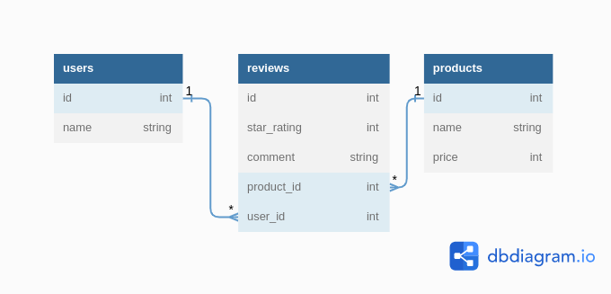

# Phase 3 Active Record Code Challenge: Product Review

## Introduction
For this assignment, we'll be working with an e-commerce domain. We'll be focusing on the product reviews.

We have three models: User, Review, and Product.

For our purposes, a Product has many Users, a User has many Products’ s, and a Review belongs to a User and to a Product.
 
Product - User is a many-to-many relationship.

Note: You should design your domain/Entity Relationship Diagram(ERD) using any Unified Modelling Language such as starUML Links to an external site.before you start coding. You are required to include it in your README

## Entity Relationship Diagram


## Prerequisites

In order to use this repository you will need the following:

- Operating System (Windows 10+, Linux 3.8+, or MacOS X 10.7+)
- RAM >= 4GB
- Free Space >= 2GB

## Setup
You can setup this repository by following this manual

1. Clone the repository

```bash
git clone git@github.com:oyieroyier/product-review.git
```

2. Ensure the ruby gems are setup in your machine

```bash
bundle install
```
3. Perform any pending database migrations and seed the database with sample data

```bash
bundle exec rake db:migrate db:seed
```

4. Test the various instances of the database

```bash
bundle exec rake console
```


## Topics
This assignment focused on the following topics:

- Active Record Migrations
- Active Record Associations
- Class and Instance Methods
- Active Record QueryingProject Setup

## Instructions
Build out all of the methods listed in the deliverables. The methods are listed in a suggested order, but you can feel free to tackle the ones you think are easiest. Be careful: some of the later methods rely on earlier ones.

**Remember!** This code challenge does not have tests. You cannot run rspec and you cannot run and learn. You'll need to create your own sample instances so that you can try out your code on your own. Make sure your associations and methods work in the console before submitting.

We've provided you with a tool that you can use to test your code. To use it, run rake console from the command line. This will start a pry session with your classes are defined. You can test out the methods that you write here. You are also encouraged to use the seeds.rb file to create sample data to test your models and associations.

Writing error-free code is more important than completing all of the deliverables listed - prioritize writing methods that work overwriting more methods that don't work. You should test your code in the console as you write.

Similarly, messy code that works is better than clean code that doesn't. First, prioritize getting things working. Then, if there is time in the end, refactor your code to adhere to best practices.

**Before you submit!** Save and run your code to verify that it works as you expect. If you have any methods that are not working yet, feel free to leave comments describing your progress.

## Deliverables

Create the following classes and their respective methods.

Set up your application so it runs from a configured run file. 

Create instances of the classes on the run file and try out the methods you just created.

Use the notation # for instance methods, and .(dot) for class methods.

Feel free to build out any helper methods if needed.

**Remember:** Active Record gives your classes access to a lot of methods already! Keep in mind what methods Active Record gives you access to in each of your classes when you're approaching the deliverables below.

### Migrations
Before working on the rest of the deliverables, you will need to create a migration for the reviews table.

1. A Review belongs to a Product, and a Review also belongs to a User. In your migration, create any columns your reviews table will need to establish these relationships.
2. The reviews table should also have:
- A star_rating column that stores an integer.
- A comment column that stores a string.

After creating and running your migration, create your Review class, and use the seeds.rb file to create Review instances so you can test your code.

**Once you've set up your reviews table,** work on building out the following deliverables

### Object Association Methods
Use Active Record association macros and Active Record query methods where appropriate (i.e. has_many, has_many through, and belongs_to).

1. `Review`
- Returns the `User` instance for this `Review`
- Returns the `Product` instance for this `Review`
- `Review#user`
- `Review#product`

2. Product
- `Product#reviews`: Returns a collection of all the Reviews for the Product
- `Product#users`: Returns a collection of all the Users who reviewed the Product
 
3. User
- `User#reviews`: Returns a collection of all the Reviews that the User has given
- `User#products`: Returns a collection of all the Products that the User has reviewed

Use the rake console and check that these methods work before proceeding. For example, you should be able to call User.first.products and see a list of the products for the first user in the database based on your seed data, and Review.first.user should return the user for the first review in the database.

### Aggregate and Association Methods
1. Review
- `Review#print_review`: This should puts in the terminal a string formatted as follows: Review for {insert product name} by {insert user name}: {insert review star_rating}. {insert review comment}

2. Product
- `Product#leave_review(user, star_rating, comment)`: Takes a User (an instance of the User class), a star_rating (integer), and a comment (string) as arguments, and creates a new Review in the database associated with this Product and the User
- Product#print_all_reviews

3. This should puts in the terminal a string representing each review for this product
4. Each review should be formatted as follows: Review for {insert product name} by {insert user name}: {insert review star_rating}. {insert review comment}

4. `Product#average_rating`
- Returns a float representing the average star rating for all reviews for this product

5. `User`
- `User#favorite_product`: Returns the product instance that has the highest star rating from this user
- `User#remove_reviews(product)`: Takes a Product (an instance of the Product class) and removes all of this user's reviews for that product. You will have to delete any rows from the reviews table associated with this user and the product
